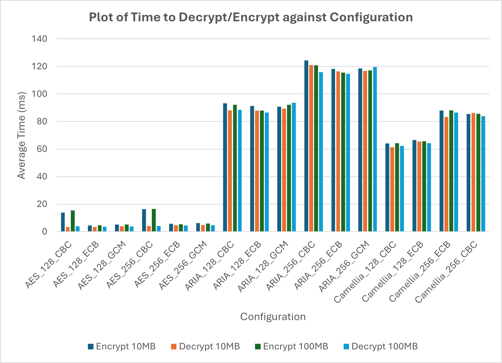

# CT437 A2 - Using and Benchmarking Blockciphers with OpenSSL

## Overview

In this assignment, OpenSSL is used to encrypt and decrypt data using different blockciphers. The CPU time of each algorithm is measured and compared in the accompanying report.

The source code, binaries and results of each problem are provided in this repository.

## Problem 1: Blockcipher Benchmarking

In this section, the following encryption settings are first measured (CPU time) and then contrast:

- AES, ARIA and Camellia Algorithm
- 128 and 256 bit key length
- ECB, CBC and GCM mode
- 10 MB and 100 MB of data
- encoding and decoding

## Problem 2: Implementing and Benchmarking Triple-DES

In this section, Triple-DES is implemented using OpenSSL's DES API with support for both CBC and ECB mode. Each mode is benchmarked using 100 MB of data and compared with the 100 MB results in Problem 1.

## Results:

### Problem 1

### Problem 2

|                   | 100MB ARIA 128bit CBC* | 100MB ECB Triple DES | 100MB CBC Triple DES |
|------------------:|:---------------------:|:---------------------:|:---------------------:|
| Encryption        | 120.83 ms             | 5057.68 ms            | 4993.18 ms            |
| Decryption        | 115.90 ms             | 4945.63 ms            | 4805.77 ms            |

*ARIA 128-bit CBC was the highest CPU time observed in section P1.